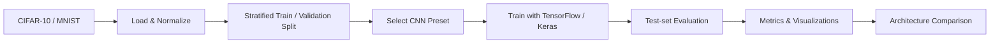
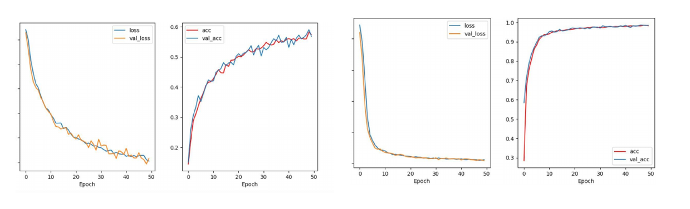
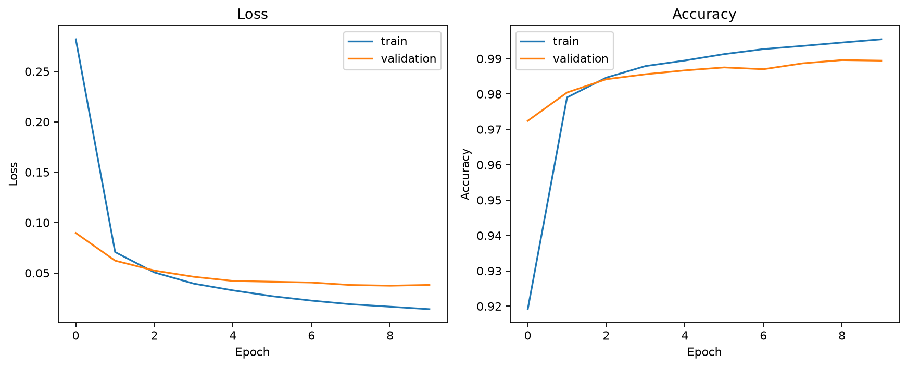
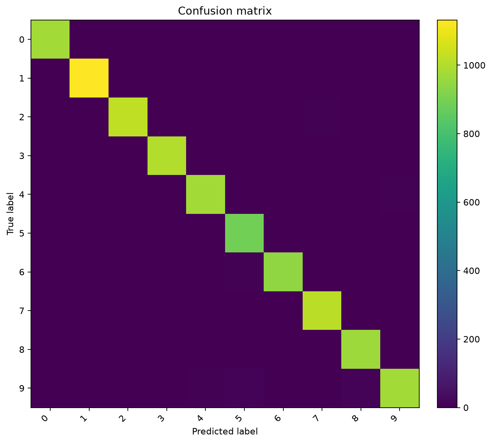
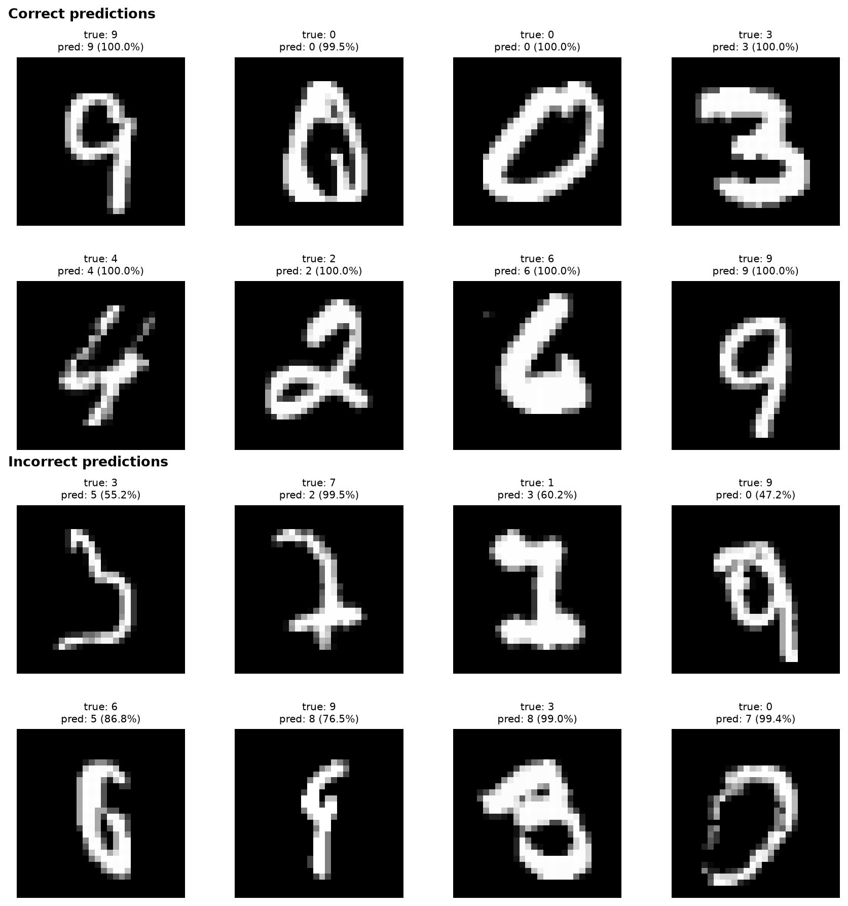

# TensorFlow CNN Image Classification

[](#)
[](#)


[简体中文](README.zh-CN.md)

**Reproducible CNN image-classification experiments on CIFAR-10 and MNIST using TensorFlow/Keras, with automated evaluation, architecture comparison, and error analysis.**

`Python` · `TensorFlow / Keras` · `CNN` · `CIFAR-10` · `MNIST` · `Computer Vision`

## At a glance

| | |
|---|---|
| **Task** | Multi-class image classification |
| **Datasets** | CIFAR-10 and MNIST |
| **Models** | Configurable CNN architecture presets |
| **Evaluation** | Accuracy, loss, macro Precision / Recall / F1, per-class metrics |
| **Visual analysis** | Learning curves, confusion matrix, correct/incorrect predictions with confidence |
| **Experiment tracking** | Parameters, training time, environment metadata, automatic ranking tables |
| **Reproducibility** | Fixed seed, deterministic split, separate validation/test sets, CLI-driven experiments |

## Experiment pipeline



The rebuilt workflow keeps the original coursework questions—network depth, filter counts, pooling choices, kernel sizes, and training duration—but turns them into a cleaner experiment pipeline rather than a collection of one-off scripts.

## Results at a glance

The strongest results recorded in the **original 2024 course report** were:

| Dataset | Historical experiment | Reported accuracy |
|---|---|---:|
| CIFAR-10 | Four-convolution model + longer training | **64.3%** |
| MNIST | Longer training | **99.0%** |

These figures are **historical coursework results**, not benchmark claims regenerated by the reconstructed code. Fresh runs are written separately to `results/` so results from different TensorFlow versions or hardware are not mixed with the archived report.

<p align="center">
  
</p>

<p align="center"><sub>Historical training curves from the archived course report: CIFAR-10 (left) and MNIST (right).</sub></p>

See [`docs/EXPERIMENTS.md`](docs/EXPERIMENTS.md) for the complete historical experiment table and the matching reproducible presets.

## What one run produces

A standard run exports recruiter-readable evidence instead of only printing a final accuracy:

| Artefact | Purpose |
|---|---|
| `metrics.json` | Test metrics, hyperparameters, split sizes, environment, parameter count and runtime |
| `history.csv` | Per-epoch training/validation metrics |
| `per_class_metrics.csv` | Precision, recall, F1 and support for every class |
| `training_curves.png` | Training vs. validation loss and accuracy |
| `confusion_matrix.png` | Class-level error distribution |
| `prediction_examples.png` | Explicit **correct vs. incorrect** examples with confidence scores |
| `model_summary.txt` | Reproducible model architecture summary |
| `model.keras` | Trained model unless `--no-save-model` is used |

After a real local run, publish the three main figures into the README with one command:

```bash
python experiments/publish_readme_assets.py --run-dir results/mnist/baseline
```

The command copies the figures into `docs/assets/readme/` **and updates both language versions of the README automatically**. This intentionally publishes only figures produced by an actual completed run—no synthetic or fabricated portfolio screenshots.

### Rebuilt-pipeline gallery

<!-- README_GALLERY_START -->
<p align="center">
  
  
</p>
<p align="center">
  
</p>
<p align="center"><sub>Figures generated by a completed run of the reconstructed pipeline.</sub></p>
<!-- README_GALLERY_END -->

## Quick start

### 1. Create an environment

macOS / Linux:

```bash
python3 -m venv .venv
source .venv/bin/activate
```

Windows PowerShell:

```powershell
py -m venv .venv
.\.venv\Scripts\Activate.ps1
```

Use a Python version supported by your TensorFlow release. Python 3.11 or 3.12 is a conservative choice.

### 2. Install dependencies

```bash
python -m pip install --upgrade pip
pip install -r requirements.txt
```

### 3. Inspect available architectures

```bash
python src/train.py --list-presets
```

### 4. Run an experiment

CIFAR-10 baseline:

```bash
python src/train.py --dataset cifar10 --preset baseline --epochs 20
```

MNIST four-convolution/two-pooling preset:

```bash
python src/train.py --dataset mnist --preset four_conv_two_pool --epochs 15
```

Fast CPU smoke test:

```bash
python src/train.py --dataset mnist --preset baseline --epochs 2 --train-limit 5000
```

Keras downloads the selected dataset automatically on first use. `--train-limit` reduces only the training subset; validation and test sets remain intact.

## Compare CNN architectures automatically

Run the documented preset matrix:

```bash
python experiments/run_experiments.py --dataset all --epochs 20
```

Or perform a faster comparison:

```bash
python experiments/run_experiments.py --dataset all --epochs 3 --train-limit 10000
```

The batch runner avoids saving every trained model by default and generates:

```text
results/experiment_summary.csv
results/experiment_summary.md
```

Models are ranked **within each dataset** by test accuracy, with test loss, best validation accuracy, parameter count, completed epochs, and training time included for comparison.

If runs already exist, rebuild the summary without retraining:

```bash
python experiments/summarize_results.py
```

<details>
<summary><strong>Command-line options</strong></summary>

```bash
python src/train.py \
  --dataset cifar10 \
  --preset four_layer \
  --epochs 30 \
  --batch-size 128 \
  --learning-rate 0.001 \
  --validation-fraction 0.2 \
  --patience 5 \
  --seed 42
```

Main controls:

- `--dataset {cifar10,mnist}`
- `--preset <name>`
- `--epochs <n>`
- `--batch-size <n>`
- `--learning-rate <value>`
- `--validation-fraction <0..1>`
- `--train-limit <n>`
- `--patience <n>`
- `--seed <n>`
- `--output-dir <path>`
- `--no-save-model`

</details>

<details>
<summary><strong>Project structure</strong></summary>

```text
.
├── .github/workflows/quality.yml
├── README.md
├── README.zh-CN.md
├── requirements.txt
├── src/
│   ├── train.py
│   └── ml_project/
│       ├── data.py
│       ├── evaluation.py
│       ├── models.py
│       ├── reporting.py
│       ├── training.py
│       └── visualization.py
├── experiments/
│   ├── publish_readme_assets.py
│   ├── run_experiments.py
│   └── summarize_results.py
├── tests/
│   └── test_reporting.py
├── docs/
│   ├── assets/
│   │   └── historical-training-curves.png
│   ├── EXPERIMENTS.md
│   ├── ORIGINAL_WORK.md
│   └── original/
│       └── 2024-course-report-cn.pdf
└── results/
    └── .gitkeep
```

</details>

## Reproducibility and quality

- Default random seed: `42`
- Deterministic, class-stratified train/validation split
- Official CIFAR-10/MNIST test sets kept separate from training and validation
- TensorFlow deterministic operations requested when supported by the installed backend
- Generated model/results excluded from Git by default to keep the repository lightweight
- Lightweight syntax and unit tests run in GitHub Actions on pushes and pull requests

Run the dependency-light checks locally:

```bash
python -m compileall -q src experiments tests
python -m unittest discover -s tests -v
```

Exact floating-point results can still vary slightly across TensorFlow versions, CPU/GPU/Metal backends, and accelerator kernels.

## Coursework provenance

This repository is a portfolio reconstruction of earlier machine-learning coursework. The original exported scripts had formatting/syntax issues, hard-coded local paths, inconsistent normalisation, and fragile manual evaluation logic. The rebuilt version preserves the experiment intent while adding reproducible data handling, named model presets, CLI controls, full-set evaluation, richer metrics, visual error analysis, and automatic experiment comparison.

The public source report is archived at [`docs/original/2024-course-report-cn.pdf`](docs/original/2024-course-report-cn.pdf). The student number was removed with true PDF redaction before publication; the technical content and author name are retained as provenance.

More detail: [`docs/ORIGINAL_WORK.md`](docs/ORIGINAL_WORK.md).

## Author

**Shuoxun Wen (Waldo)** — Computer Science undergraduate.
