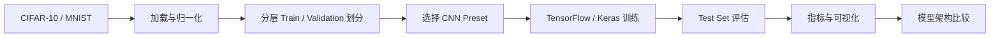

# TensorFlow CNN 图像分类

[](#)
[](#)


[English README](README.md)

**使用 TensorFlow/Keras 在 CIFAR-10 与 MNIST 上完成可复现的 CNN 图像分类实验，并自动进行模型评估、架构对比和错误案例分析。**

`Python` · `TensorFlow / Keras` · `CNN` · `CIFAR-10` · `MNIST` · `Computer Vision`

## 项目速览

| | |
|---|---|
| **任务** | 多类别图像分类 |
| **数据集** | CIFAR-10、MNIST |
| **模型** | 可配置的 CNN 架构 preset |
| **评估指标** | Accuracy、Loss、Macro Precision / Recall / F1、每类别指标 |
| **可视化分析** | 训练曲线、混淆矩阵、正确/错误预测及置信度 |
| **实验比较** | 参数量、训练耗时、环境信息、自动排名表 |
| **可复现性** | 固定 seed、确定性划分、独立 validation/test、CLI 驱动实验 |

## 实验流程



新版保留原课程设计真正想研究的问题——网络深度、filter 数量、池化方式、卷积核和训练时长——但不再把它们写成一组一次性脚本，而是整理成统一、可复现的实验流程。

## 结果速览

**2024 年原课程设计报告**记录的最佳结果为：

| 数据集 | 历史实验 | 报告准确率 |
|---|---|---:|
| CIFAR-10 | 四层卷积 + 更长训练 | **64.3%** |
| MNIST | 增加训练次数 | **99.0%** |

这里展示的是**历史课程实验结果**，不是把旧结果冒充成新版代码重新跑出的 benchmark。新版程序产生的新实验会单独写入 `results/`，避免不同 TensorFlow 版本或硬件环境的结果与原报告混在一起。

<p align="center">
  
</p>

<p align="center"><sub>原课程报告中的历史训练曲线：左侧为 CIFAR-10，右侧为 MNIST。</sub></p>

完整历史实验与新版 preset 对应关系见 [`docs/EXPERIMENTS.md`](docs/EXPERIMENTS.md)。

## 一次训练会得到什么？

新版不会只在终端里打印一个 accuracy，而是为每次实验自动留下可检查的证据：

| 文件 | 用途 |
|---|---|
| `metrics.json` | 测试指标、超参数、数据划分、环境、参数量和训练耗时 |
| `history.csv` | 每个 epoch 的训练/验证指标 |
| `per_class_metrics.csv` | 每个类别的 Precision、Recall、F1、Support |
| `training_curves.png` | Train / Validation 的 Loss 与 Accuracy 曲线 |
| `confusion_matrix.png` | 各类别之间的错误分布 |
| `prediction_examples.png` | 明确区分的**正确 / 错误预测**和置信度 |
| `model_summary.txt` | 可复查的模型结构 |
| `model.keras` | 训练模型；使用 `--no-save-model` 时不保存 |

本地完成一次真实训练后，可以用一条命令把三张最适合展示的图片发布到 README：

```bash
python experiments/publish_readme_assets.py --run-dir results/mnist/baseline
```

这条命令会把图片复制到 `docs/assets/readme/`，并**自动更新英文和中文 README 的图片展示区**。这个流程只会发布真实完成的实验产生的图片，不会为了 Portfolio 制造虚假的训练截图。

### 新版实验图片展示

<!-- README_GALLERY_START -->
<p align="center">
  
  
</p>
<p align="center">
  
</p>
<p align="center"><sub>以上图片由重构后的实验流程实际运行生成。</sub></p>
<!-- README_GALLERY_END -->

## 快速开始

### 1. 创建虚拟环境

macOS / Linux：

```bash
python3 -m venv .venv
source .venv/bin/activate
```

Windows PowerShell：

```powershell
py -m venv .venv
.\.venv\Scripts\Activate.ps1
```

建议使用当前 TensorFlow 版本支持的 Python；Python 3.11 / 3.12 是相对稳妥的选择。

### 2. 安装依赖

```bash
python -m pip install --upgrade pip
pip install -r requirements.txt
```

### 3. 查看 CNN 配置

```bash
python src/train.py --list-presets
```

### 4. 运行实验

CIFAR-10 基础模型：

```bash
python src/train.py --dataset cifar10 --preset baseline --epochs 20
```

MNIST 四层卷积 / 两层池化：

```bash
python src/train.py --dataset mnist --preset four_conv_two_pool --epochs 15
```

快速 CPU smoke test：

```bash
python src/train.py --dataset mnist --preset baseline --epochs 2 --train-limit 5000
```

Keras 第一次运行会自动下载数据集。`--train-limit` 只缩小训练子集，validation 和 test 保持完整。

## 自动比较不同 CNN 架构

运行完整 preset matrix：

```bash
python experiments/run_experiments.py --dataset all --epochs 20
```

快速比较：

```bash
python experiments/run_experiments.py --dataset all --epochs 3 --train-limit 10000
```

批量实验默认不保存每一个 `.keras` 模型，避免磁盘占用过大，并自动生成：

```text
results/experiment_summary.csv
results/experiment_summary.md
```

模型会在**各自数据集内部**按 test accuracy 排名，并同时展示 test loss、最佳 validation accuracy、参数量、实际 epoch 数和训练耗时。

已有实验结果时，不重新训练也可以重建比较表：

```bash
python experiments/summarize_results.py
```

<details>
<summary><strong>Command-line 参数</strong></summary>

```bash
python src/train.py \
  --dataset cifar10 \
  --preset four_layer \
  --epochs 30 \
  --batch-size 128 \
  --learning-rate 0.001 \
  --validation-fraction 0.2 \
  --patience 5 \
  --seed 42
```

主要参数：

- `--dataset {cifar10,mnist}`
- `--preset <name>`
- `--epochs <n>`
- `--batch-size <n>`
- `--learning-rate <value>`
- `--validation-fraction <0..1>`
- `--train-limit <n>`
- `--patience <n>`
- `--seed <n>`
- `--output-dir <path>`
- `--no-save-model`

</details>

<details>
<summary><strong>项目结构</strong></summary>

```text
.
├── .github/workflows/quality.yml
├── README.md
├── README.zh-CN.md
├── requirements.txt
├── src/
│   ├── train.py
│   └── ml_project/
│       ├── data.py
│       ├── evaluation.py
│       ├── models.py
│       ├── reporting.py
│       ├── training.py
│       └── visualization.py
├── experiments/
│   ├── publish_readme_assets.py
│   ├── run_experiments.py
│   └── summarize_results.py
├── tests/
│   └── test_reporting.py
├── docs/
│   ├── assets/
│   │   └── historical-training-curves.png
│   ├── EXPERIMENTS.md
│   ├── ORIGINAL_WORK.md
│   └── original/
│       └── 2024-course-report-cn.pdf
└── results/
    └── .gitkeep
```

</details>

## 可复现性与质量检查

- 默认 random seed：`42`
- 确定性的按类别分层 train / validation 划分
- CIFAR-10 / MNIST 官方 test set 与训练、验证完全分开
- TensorFlow/backend 支持时请求 deterministic operations
- 生成的模型和结果默认不进入 Git，避免仓库膨胀
- GitHub Actions 在 push / pull request 时自动运行轻量语法和单元测试

本地不安装 TensorFlow 也可以执行仓库级检查：

```bash
python -m compileall -q src experiments tests
python -m unittest discover -s tests -v
```

由于 TensorFlow 版本、CPU/GPU/Metal 后端和浮点内核不同，完整训练的数值仍可能出现轻微差异。

## 从课程设计到 Portfolio 项目

这是本人早期机器学习课程设计的 Portfolio 重构版。原导出的脚本存在格式 / SyntaxError、本地绝对路径、归一化不一致和手工评估逻辑脆弱等问题；新版保留课程实验意图，同时重新实现可复现的数据处理、CNN preset、CLI、完整测试集评估、每类别指标、错误案例可视化以及自动架构比较。

公开版原课程报告保存在 [`docs/original/2024-course-report-cn.pdf`](docs/original/2024-course-report-cn.pdf)。为了 Public Repository 的隐私安全，学号已通过真正的 PDF redaction 从底层内容删除；姓名和技术内容保留，用作项目来源证明。

更多说明：[`docs/ORIGINAL_WORK.md`](docs/ORIGINAL_WORK.md)。

## 作者

**Shuoxun Wen (Waldo)** — Computer Science undergraduate.
